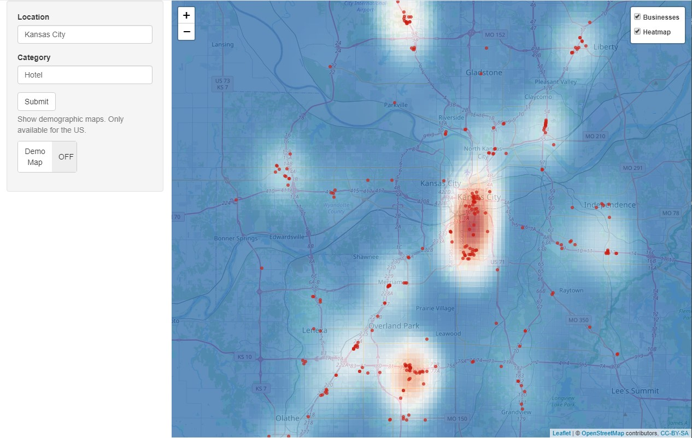
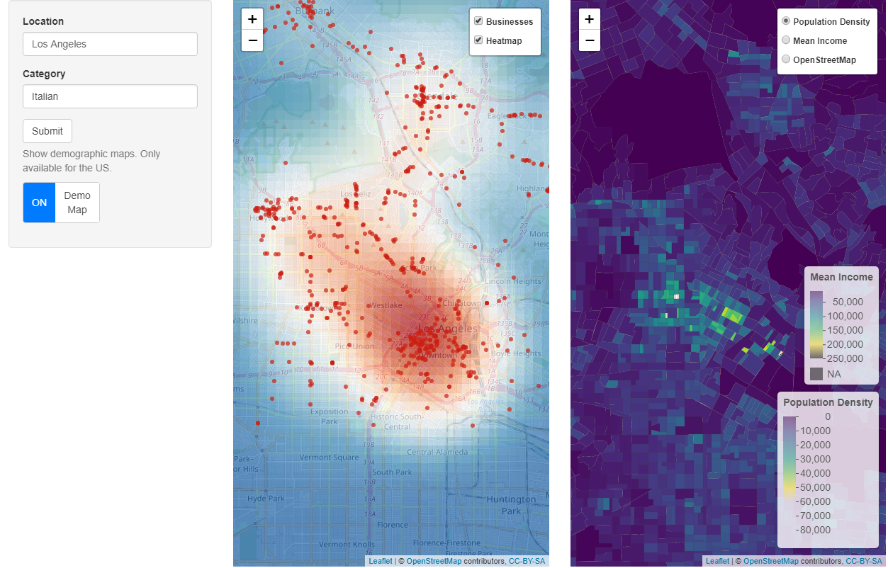

# Business Density and Demographics Explorer

This Shiny app allows users to explore the density of businesses within a specific category (e.g., restaurants, hotels) and location (e.g., Houston) using Yelp's API. The app also displays demographic information, such as population density and mean income, for the corresponding area within the United States.





## Features

- Search for businesses in a specific location and category
- Interactive heatmap showing the density of businesses
- Interactive demographic maps displaying population density and mean income
- Synced map views for easier comparison
- Dynamic layer controls

## Setup and Running

1. Install the required R packages:

```R
install.packages(c("shiny", "tidyverse", "leaflet", "httr", "jsonlite", "sf", "viridis", "raster", "spatstat", "shinyWidgets", "tidycensus"))
```

2. Obtain Yelp API key by following the instructions [here](https://docs.developer.yelp.com/docs/fusion-authentication) and Census.gov API key by visiting [this page](http://api.census.gov/data/key_signup.html).

3. Create a `config.R` file in the project root directory and store your API keys:

    ```R
    yelp_api_key <- "your_yelp_api_key"
    census.gov_api_key <- "your_census_api_key"
    ```

4. Run the app from your R console or RStudio:

    ```R
    shiny::runApp("path/to/your/app")
    ```

## Acknowledgements

This app uses data from [Yelp](https://www.yelp.com/developers) and [U.S. Census Bureau](https://www.census.gov/developers/).

## License

This project is licensed under the MIT License - see the [LICENSE](LICENSE)
